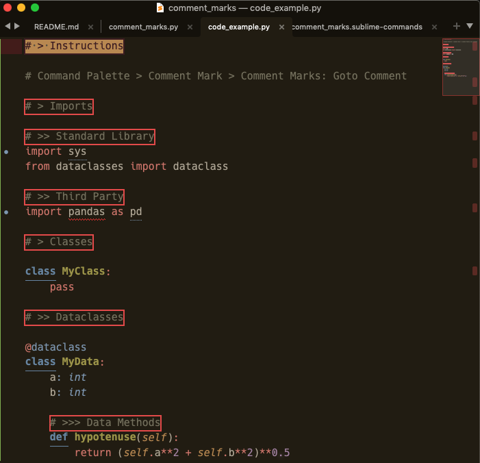
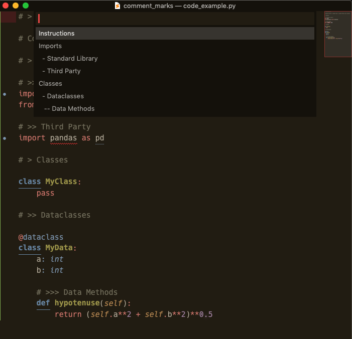

# Comment Marks

**Set bookmarks or section headings simply with comments and a special character.**

_Will probably require sublime restart after installation_

_Comment Marks_ are highlighted below (using Sublime Text Find) in a piece of example code



---

Running the `Goto Comment Mark` Command (see [Usage](#usage) below) will provide the searchable quickpanel seen below which will take you to the selected comment.



## Example

```python

def my_function():
	retun 'hello world'

# > Main

def main():
	my_function()

# >> Main trigger

if __name__ == '__main__':
	main()
```


In the python code above, two _marks_ or _sections_ are set (`Main` and `Main trigger`) by using `>` characters in comments.

The number of `>` characters defines what level the section has much like hashes for headings in a markdown file.

## Usage

* **Command Palette**: `Goto Comment Mark`
* No **Key binding** set, but go to `Preferences` > `Package Settings` > `Comment Marks` > `Key Bindings`
	* You will see examples on the right and your user key bindings configuration file on the right.  Feel free to copy-paste across.


## Design

* Provide an approach to creating, searching and navigating to arbitrary bookmarks in a file.
* Make the process easy, lightweight and essentially editor independent.
* Use a plugin that is simple but configurable and _hopefully_ performant.

This plugin is similar to `Table of comments` ([see Page on Package Control](https://packagecontrol.io/packages/Table%20of%20comments)).

**Differences**:

* Simpler functionality and code base (_hopefully so that it is more easily hacked by users_)
	- Uses `python 3.8`, and is therefore compatible only with `Sublime Text v4`
* More configurable (_I think_)
* Faster (_in my experience_)
	- Specifically, I'm referring to the time from running the `Goto Comment Mark` and seeing the quick panel (and the equivalent in `Table of comments`).
	- If this plugin is faster, it's probably due to these reasons:
		+ regex paterns are prepared on plugin load not when the commands are run
		+ plugin is minimal
		+ uses `python 3.8` (??).


## Configuration

* Goto `Preferences` > `Package Settings` > `Comment Marks` > `Settings`, which will open the default settings on the left your custom settings on the right.

```javascript
{
    // Character to use in comments for creating Comment Marks
    "default_level_char": ">",

    // Custom level char for specific scopes
    // scope must be configured in scope_comment_chars below to take effect
    // To find the scope of a file, hit CTRL+SHIFT+P, and see top line, or
    // in control panel, run `view.syntax().scope`
    "level_chars": {
        "source.python": ">"
    },

    // Control the formatting of Comment Marks in the quick panel
    // Numeric keys signify what level of Comment Mark the formatting applies to
    // String value is what will replace the level_chars in the quick panel ...
    // ... note the spaces which create indentation
    "level_char_format_sub": {
        "1": "",
        "2": "  - ",
        "3": "   -- ",
        "4": "    --",
        "5": "     --"
    },

    // If going to have custom settings for a particular scope,
    // that scope must have a parameter in scope_comment_chars (below),
    // as all other settings flow from the scopes identified here.
    // This is because all regex patterns are prepared on package load.
    // These comment characters are put together in a larger pattern that
    // presumes these characters can occur 1 or more times (using `+`) ...
    // ... see the `source.python` example in custom_comment_start_patterns
    // below for what this pattern looks like for python.
    // When a file's scope is not here, default characters are used instead
    // where the first character/sequence found is used
    // **WARNING** - If providing your own user parameters,
    // to retain any of these default parameters, they must be copied/included
    // in your user settings file.
    "scope_comment_chars": {
        "default": ["#", "/", "/*", "%", "<!--", "-"],
        "source.python": ["#"],
        "source.json.sublime.keymap": ["/"]
    },

    // Provide specific regex for detecting comments for specific scopes
    // These patterns will override those automatically generated from
    // the characters in scope_comment_chars
    "custom_comment_start_patterns": {
        "source.python": ["^[ \t]*#+"]
    },

}

```
